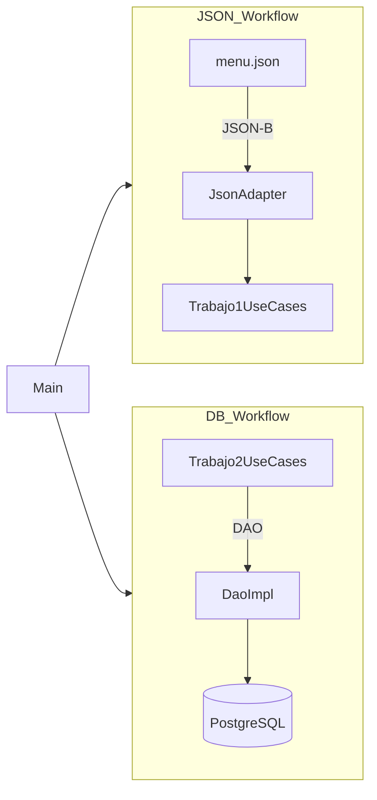
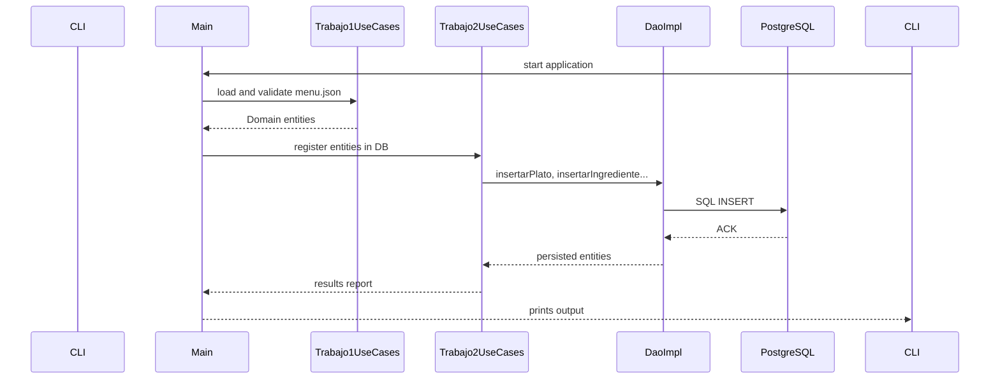

**CulinaryCadence: A Synchronized JSON and Database-Driven Menu Management System**

---

## Overview

**CulinaryCadence** is a modular Java application designed to streamline menu and recipe management by leveraging both JSON-based input and a PostgreSQL relational database. It demonstrates modern engineering practices including:

* Separation of concerns via **Domain**, **Application**, and **Infrastructure** layers.
* Dual JSON processing using **JSON-P** and **JSON-B**.
* **DAO** pattern for persistence, decoupling business logic from data access.
* Schema-driven database initialization with **database.sql**.
* Robust error handling via a hierarchy of domain-specific exceptions.

## Table of Contents

1. [Architecture](#architecture)
2. [Diagrams](#diagrams)

    * [Architecture Diagram](#architecture-diagram)
    * [Sequence Diagram](#sequence-diagram)
3. [Technologies](#technologies)
4. [Prerequisites](#prerequisites)
5. [Installation](#installation)
6. [Usage](#usage)
7. [Project Structure](#project-structure)
8. [License](#license)

## Architecture

The project adheres to a layered architecture:

* **Domain**: Entities (`es.upsa.bbdd2.trabajo_1y2.domain.entities`) and exceptions define the core business model and invariants.
* **Application**: Interfaces and use-case implementations (`es.upsa.bbdd2.trabajo_1y2.application`) encapsulate business operations.
* **Infrastructure**: JSON adapters and DAO implementations manage I/O (JSON-P/B, JDBC/PostgreSQL).

### Components

* **Main**: Entry point orchestrating JSON parsing, business use cases, and database interactions.
* **Dao & DaoImpl**: Abstract persistence contract and PostgreSQL-specific implementation.
* **JsonAdapter & JsonUtils**: Abstractions for JSON serialization/deserialization, implemented via JSON-P and JSON-B.
* **Use Cases**: `Trabajo1UseCases` for JSON workflows; `Trabajo2UseCases` for database-centric operations.

## Diagrams

### Architecture Diagram



### Sequence Diagram



## Technologies

| Layer           | Technology                      |
| --------------- | ------------------------------- |
| Language        | Java 21                         |
| Build Tool      | Maven                           |
| JSON Processing | Jakarta JSON-P (Yasson), JSON-B |
| Database        | PostgreSQL 14+                  |
| Persistence     | JDBC                            |
| Utilities       | Lombok (provided scope)         |

## Prerequisites

* Java JDK 21+
* Maven 3.8+
* PostgreSQL 14 or higher
* Network access to `jdbc:postgresql://localhost:5432/upsa`

## Installation

1. **Clone the repository**

   ```bash
   git clone <repository-url>
   cd Trabajo_1y2
   ```

2. **Initialize the database**

   ```bash
   psql -U your_user -d your_db -f database.sql
   ```

3. **Build the project**

   ```bash
   mvn clean package
   ```

## Usage

Run the generated JAR with appropriate database credentials:

```bash
java -jar target/Trabajo_1y2-1.0.0.jar \
  --db.url=jdbc:postgresql://localhost:5432/upsa \
  --db.user=system \
  --db.password=manager
```

The application will:

1. Parse **menu.json** via JSON-P and JSON-B.
2. Validate domain constraints (e.g., non-empty names, valid date ranges).
3. Persist entities (`Plato`, `Ingrediente`, `Menu`) into PostgreSQL.
4. Execute sample queries defined in `Main.java` and print results.

## Project Structure

```
└── src
    ├── main
    │   ├── java
    │   │   └── es.upsa.bbdd2.trabajo_1y2
    │   │       ├── Main.java
    │   │       ├── application
    │   │       ├── domain
    │   │       └── infrastructure
    │   └── resources
    └── test
```

## License

This project is licensed under the **MIT License**. See [LICENSE](LICENSE) for details.
